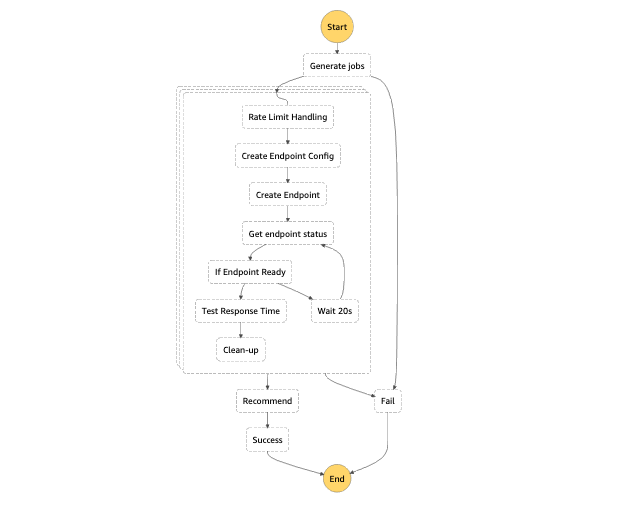

# sagemaker-instancetype-advisor

Wondering what will be the best instance type for your SageMaker instance? Automate your load testing and get insights on response time and costs.

## External resources

1. [Locust](https://github.com/locustio/locust): Locust is an easy to use, scriptable and scalable performance testing tool.
2. [Locust on Fargate](https://github.com/MatthieuBlais/cloud-distributed-locust): This application integrates with this Locust on Fargate repository. Therefore, you need to follow the initial setup to use this app.

## Deployment

Follow this [README.md] to deploy the CloudFormation templates.



## Usage

Sample Job Input for the Step Function:

```
{
  "EndpointName": "ENDPOINT_NAME",
  "ModelName": "EXISTING_SAGEMAKER_MODEL",
  "Filters": {SEE_BELOW},
  "AdvisorJob": {
    "ClusterName": "YOUR_FARGATE_CLUSTER",
    "TaskDefinition": "YOUR_LOCUST_TASK_DEFINITION",
    "Subnets": [YOUR_SUBNETS],
    "SecurityGroups": [YOUR_SECURITY_GROUPS],
    "TaskName": "LOCUST_TASK_NAME",
    "Percentiles": [
      "50",
      "75"
    ],
    "PricingLocation": "AWS_PRICING_CATALOG_LOCATION",
    "StagingBucket": "YOUR_STAGING_BUCKET",
    "ExpectedWorkers": 2,
    "Shapes": [
      {
        "Users": 20,
        "Duration": 15
      },
      {
        "Users": 25,
        "Duration": 30
      },
      {
        "Users": 30,
        "Duration": 45
      },
      {
        "Users": 35,
        "Duration": 60
      },
      {
        "Users": 40,
        "Duration": 75
      },
      {
        "Users": 45,
        "Duration": 90
      },
      {
        "Users": 50,
        "Duration": 105
      },
      {
        "Users": 55,
        "Duration": 120
      },
      {
        "Users": 0,
        "Duration": 135
      }
    ],
    "EndpointHost": "YOUR_API_ENDPOINT",
    "Method": "/endpoint",
    "TestDataKey": "LOCATION_OF_YOUR_MODEL_TEST_DATA"
  },
  "PassingCriteria": {
    "Users": 45,
    "ResponseTime": 200,
    "Percentile": "50"
  }
}
```

- ModelName: Name of your model as registered on SageMaker
- PricingLocation: Pricing depends on your AWS Region. Specify which location to use.
- ExpectedWorkers: Number of Locust workers to use
- Shapes: Add multiple user count to see the response time trend when the number of users increase. Make sure to end with Users:0 to indicates the end of the job.
- Endpoint host: HTTPS url of your API gateway created by the Cloudformation template api.yaml
- TestDataKey: S3 key of the CSV file containing sample body to use when querying your model


### Filters

Sample Filters:

```
{
    "vCPU": {
      "Min": 4,
      "Max": 32
    },
    "Memory": {
      "Min": 4,
      "Max": 32
    },
    "GPU": {
      "Min": 0,
      "Max": 32
    },
    "Price": {
      "Min": 0,
      "Max": 32
    },
    "Instances": [],
    "Limit": 4
}
```

Use CPU, Memory, GPU & On-demand price to automatically filter instance types of SageMaker Catalog.

For example, when you set vCPU.Min = 4 and vCPU.Max=32, you tell the app to skip all SageMaker instances with less than 4 vCPU or more than 32 vCPU.

If you already know what instance types you want to test, you can specify them on the list of Instances.

Use limit to reduce the number of instances selected by the app. Limit=4 means the app will select maximum 4 instance types. It will try to select the cheaper instances first, but will try to choose instances with different specifications in terms of vCPU and Memory.


### Passing Criteria

Specify the SLA to be met by your API. 

How to read it: For a specific number of users ("Users"), the response time of p50 requests must be below 200ms.

```
"PassingCriteria": {
    "Users": 45,
    "ResponseTime": 200,
    "Percentile": "50"
  }
```

By default, the app will select the cheaper instances passing this criteria. You can add a key "OrderBy": "ResponseTime", if you want to get the instances with fastest response time first.


### Sample Output

List of recommended instance types and summary of load testing for each instance. You can use the history to draw some line charts to better visualize the evolution of response time related to the increase of users. 

```
{
  "Recommendations": [
    {
      "InstanceDetails": {
        "instanceName": "ml.c5.xlarge",
        "computeType": "Compute Optimized Instances",
        "vCpu": 4,
        "memory": 8,
        "gpu": 0,
        "gpuMemory": 0,
        "onDemandUsdPrice": 0.235
      },
      "Datapoint": {
        "user_count": 45,
        "average_rps": 28.5,
        "average_fps": 0,
        "count": 18,
        "p50": {
          "min": 51,
          "max": 59,
          "avg": 54.44
        },
        "p75": {
          "min": 61,
          "max": 79,
          "avg": 68.83
        }
      }
    },
    {
      "InstanceDetails": {
        "instanceName": "ml.r5.xlarge",
        "computeType": "Memory Optimized Instances",
        "vCpu": 4,
        "memory": 32,
        "gpu": 0,
        "gpuMemory": 0,
        "onDemandUsdPrice": 0.365
      },
      "Datapoint": {
        "user_count": 45,
        "average_rps": 28.31,
        "average_fps": 0,
        "count": 18,
        "p50": {
          "min": 57,
          "max": 69,
          "avg": 62.28
        },
        "p75": {
          "min": 72,
          "max": 100,
          "avg": 81.61
        }
      }
    },
    {
      "InstanceDetails": {
        "instanceName": "ml.c5.2xlarge",
        "computeType": "Compute Optimized Instances",
        "vCpu": 8,
        "memory": 16,
        "gpu": 0,
        "gpuMemory": 0,
        "onDemandUsdPrice": 0.47
      },
      "Datapoint": {
        "user_count": 45,
        "average_rps": 28.34,
        "average_fps": 0,
        "count": 18,
        "p50": {
          "min": 54,
          "max": 60,
          "avg": 56.28
        },
        "p75": {
          "min": 64,
          "max": 82,
          "avg": 71.5
        }
      }
    }
  ],
  "History": [
    {
      "InstanceDetails": {
        "instanceName": "ml.c5.xlarge",
        "computeType": "Compute Optimized Instances",
        "vCpu": 4,
        "memory": 8,
        "gpu": 0,
        "gpuMemory": 0,
        "onDemandUsdPrice": 0.235
      },
      "Results": [
        {
          "user_count": 0,
          "average_rps": 35.1,
          "average_fps": 0,
          "count": 1,
          "p50": {
            "min": 55,
            "max": 55,
            "avg": 55
          },
          "p75": {
            "min": 67,
            "max": 67,
            "avg": 67
          }
        },
        {
          "user_count": 20,
          "average_rps": 9.26,
          "average_fps": 0,
          "count": 3,
          "p50": {
            "min": 58,
            "max": 1200,
            "avg": 440.33
          },
          "p75": {
            "min": 73,
            "max": 1300,
            "avg": 497.67
          }
        },
        {
          "user_count": 25,
          "average_rps": 15.07,
          "average_fps": 0,
          "count": 6,
          "p50": {
            "min": 54,
            "max": 63,
            "avg": 58
          },
          "p75": {
            "min": 66,
            "max": 86,
            "avg": 76
          }
        },
        {
          "user_count": 30,
          "average_rps": 18.46,
          "average_fps": 0,
          "count": 10,
          "p50": {
            "min": 51,
            "max": 60,
            "avg": 55.7
          },
          "p75": {
            "min": 60,
            "max": 74,
            "avg": 69
          }
        },
        {
          "user_count": 35,
          "average_rps": 22.3,
          "average_fps": 0,
          "count": 12,
          "p50": {
            "min": 52,
            "max": 58,
            "avg": 54.5
          },
          "p75": {
            "min": 62,
            "max": 74,
            "avg": 67.75
          }
        },
        {
          "user_count": 40,
          "average_rps": 25.17,
          "average_fps": 0,
          "count": 16,
          "p50": {
            "min": 51,
            "max": 58,
            "avg": 54.31
          },
          "p75": {
            "min": 63,
            "max": 79,
            "avg": 67.88
          }
        },
        {
          "user_count": 45,
          "average_rps": 28.5,
          "average_fps": 0,
          "count": 18,
          "p50": {
            "min": 51,
            "max": 59,
            "avg": 54.44
          },
          "p75": {
            "min": 61,
            "max": 79,
            "avg": 68.83
          }
        },
        {
          "user_count": 50,
          "average_rps": 31.76,
          "average_fps": 0,
          "count": 21,
          "p50": {
            "min": 51,
            "max": 58,
            "avg": 55.71
          },
          "p75": {
            "min": 64,
            "max": 79,
            "avg": 70.86
          }
        },
        {
          "user_count": 55,
          "average_rps": 34.67,
          "average_fps": 0,
          "count": 25,
          "p50": {
            "min": 53,
            "max": 59,
            "avg": 55.52
          },
          "p75": {
            "min": 64,
            "max": 77,
            "avg": 71
          }
        }
      ]
    },
    {
      "InstanceDetails": {
        "instanceName": "ml.t2.xlarge",
        "computeType": "Standard Instances",
        "vCpu": 4,
        "memory": 16,
        "gpu": 0,
        "gpuMemory": 0,
        "onDemandUsdPrice": 0.28
      },
      "Results": [
        {
          "user_count": 20,
          "average_rps": 8.3,
          "average_fps": 0,
          "count": 3,
          "p50": {
            "min": 53,
            "max": 730,
            "avg": 281.33
          },
          "p75": {
            "min": 60,
            "max": 840,
            "avg": 329.67
          }
        },
        {
          "user_count": 25,
          "average_rps": 15.4,
          "average_fps": 0,
          "count": 6,
          "p50": {
            "min": 47,
            "max": 53,
            "avg": 49
          },
          "p75": {
            "min": 55,
            "max": 64,
            "avg": 58.17
          }
        },
        {
          "user_count": 30,
          "average_rps": 16,
          "average_fps": 0,
          "count": 10,
          "p50": {
            "min": 46,
            "max": 700,
            "avg": 327.1
          },
          "p75": {
            "min": 53,
            "max": 990,
            "avg": 483.3
          }
        },
        {
          "user_count": 35,
          "average_rps": 16.17,
          "average_fps": 0,
          "count": 12,
          "p50": {
            "min": 47,
            "max": 1100,
            "avg": 628.5
          },
          "p75": {
            "min": 53,
            "max": 1400,
            "avg": 842.25
          }
        },
        {
          "user_count": 40,
          "average_rps": 20.13,
          "average_fps": 0,
          "count": 16,
          "p50": {
            "min": 46,
            "max": 1400,
            "avg": 576.81
          },
          "p75": {
            "min": 55,
            "max": 1600,
            "avg": 761.75
          }
        },
        {
          "user_count": 45,
          "average_rps": 14.76,
          "average_fps": 0,
          "count": 18,
          "p50": {
            "min": 1100,
            "max": 2000,
            "avg": 1461.11
          },
          "p75": {
            "min": 1500,
            "max": 2300,
            "avg": 1872.22
          }
        },
        {
          "user_count": 50,
          "average_rps": 14.19,
          "average_fps": 0,
          "count": 21,
          "p50": {
            "min": 1500,
            "max": 2800,
            "avg": 1966.67
          },
          "p75": {
            "min": 1800,
            "max": 3600,
            "avg": 2438.1
          }
        },
        {
          "user_count": 55,
          "average_rps": 23.22,
          "average_fps": 0,
          "count": 25,
          "p50": {
            "min": 48,
            "max": 2300,
            "avg": 1115.6
          },
          "p75": {
            "min": 57,
            "max": 2800,
            "avg": 1539.44
          }
        }
      ]
    },
    {
      "InstanceDetails": {
        "instanceName": "ml.r5.xlarge",
        "computeType": "Memory Optimized Instances",
        "vCpu": 4,
        "memory": 32,
        "gpu": 0,
        "gpuMemory": 0,
        "onDemandUsdPrice": 0.365
      },
      "Results": [
        {
          "user_count": 20,
          "average_rps": 10.51,
          "average_fps": 0,
          "count": 3,
          "p50": {
            "min": 60,
            "max": 96,
            "avg": 76.67
          },
          "p75": {
            "min": 73,
            "max": 790,
            "avg": 324.33
          }
        },
        {
          "user_count": 25,
          "average_rps": 15.28,
          "average_fps": 0,
          "count": 6,
          "p50": {
            "min": 56,
            "max": 58,
            "avg": 57
          },
          "p75": {
            "min": 69,
            "max": 73,
            "avg": 71.33
          }
        },
        {
          "user_count": 30,
          "average_rps": 18.56,
          "average_fps": 0,
          "count": 10,
          "p50": {
            "min": 54,
            "max": 59,
            "avg": 56.6
          },
          "p75": {
            "min": 66,
            "max": 77,
            "avg": 70.6
          }
        },
        {
          "user_count": 35,
          "average_rps": 22.25,
          "average_fps": 0,
          "count": 12,
          "p50": {
            "min": 55,
            "max": 63,
            "avg": 58.5
          },
          "p75": {
            "min": 67,
            "max": 87,
            "avg": 73.75
          }
        },
        {
          "user_count": 40,
          "average_rps": 25.24,
          "average_fps": 0,
          "count": 16,
          "p50": {
            "min": 55,
            "max": 63,
            "avg": 59.31
          },
          "p75": {
            "min": 66,
            "max": 87,
            "avg": 75.31
          }
        },
        {
          "user_count": 45,
          "average_rps": 28.31,
          "average_fps": 0,
          "count": 18,
          "p50": {
            "min": 57,
            "max": 69,
            "avg": 62.28
          },
          "p75": {
            "min": 72,
            "max": 100,
            "avg": 81.61
          }
        },
        {
          "user_count": 50,
          "average_rps": 31.32,
          "average_fps": 0,
          "count": 21,
          "p50": {
            "min": 59,
            "max": 70,
            "avg": 61.62
          },
          "p75": {
            "min": 72,
            "max": 100,
            "avg": 82.71
          }
        },
        {
          "user_count": 55,
          "average_rps": 34.8,
          "average_fps": 0,
          "count": 25,
          "p50": {
            "min": 59,
            "max": 66,
            "avg": 63.16
          },
          "p75": {
            "min": 70,
            "max": 92,
            "avg": 82.52
          }
        }
      ]
    },
    {
      "InstanceDetails": {
        "instanceName": "ml.c5.2xlarge",
        "computeType": "Compute Optimized Instances",
        "vCpu": 8,
        "memory": 16,
        "gpu": 0,
        "gpuMemory": 0,
        "onDemandUsdPrice": 0.47
      },
      "Results": [
        {
          "user_count": 0,
          "average_rps": 35.8,
          "average_fps": 0,
          "count": 1,
          "p50": {
            "min": 58,
            "max": 58,
            "avg": 58
          },
          "p75": {
            "min": 73,
            "max": 73,
            "avg": 73
          }
        },
        {
          "user_count": 20,
          "average_rps": 11.39,
          "average_fps": 0,
          "count": 3,
          "p50": {
            "min": 59,
            "max": 100,
            "avg": 74.33
          },
          "p75": {
            "min": 71,
            "max": 620,
            "avg": 267
          }
        },
        {
          "user_count": 25,
          "average_rps": 15,
          "average_fps": 0,
          "count": 6,
          "p50": {
            "min": 59,
            "max": 63,
            "avg": 61.33
          },
          "p75": {
            "min": 70,
            "max": 82,
            "avg": 78
          }
        },
        {
          "user_count": 30,
          "average_rps": 18.44,
          "average_fps": 0,
          "count": 10,
          "p50": {
            "min": 52,
            "max": 60,
            "avg": 55.5
          },
          "p75": {
            "min": 66,
            "max": 80,
            "avg": 72.8
          }
        },
        {
          "user_count": 35,
          "average_rps": 22.1,
          "average_fps": 0,
          "count": 12,
          "p50": {
            "min": 53,
            "max": 60,
            "avg": 57
          },
          "p75": {
            "min": 68,
            "max": 87,
            "avg": 74.33
          }
        },
        {
          "user_count": 40,
          "average_rps": 25.15,
          "average_fps": 0,
          "count": 16,
          "p50": {
            "min": 52,
            "max": 59,
            "avg": 55.69
          },
          "p75": {
            "min": 66,
            "max": 80,
            "avg": 70.62
          }
        },
        {
          "user_count": 45,
          "average_rps": 28.34,
          "average_fps": 0,
          "count": 18,
          "p50": {
            "min": 54,
            "max": 60,
            "avg": 56.28
          },
          "p75": {
            "min": 64,
            "max": 82,
            "avg": 71.5
          }
        },
        {
          "user_count": 50,
          "average_rps": 31.57,
          "average_fps": 0,
          "count": 21,
          "p50": {
            "min": 54,
            "max": 60,
            "avg": 56.38
          },
          "p75": {
            "min": 68,
            "max": 85,
            "avg": 73.14
          }
        },
        {
          "user_count": 55,
          "average_rps": 34.68,
          "average_fps": 0,
          "count": 25,
          "p50": {
            "min": 54,
            "max": 66,
            "avg": 57.56
          },
          "p75": {
            "min": 70,
            "max": 89,
            "avg": 75.36
          }
        }
      ]
    }
  ]
}
```